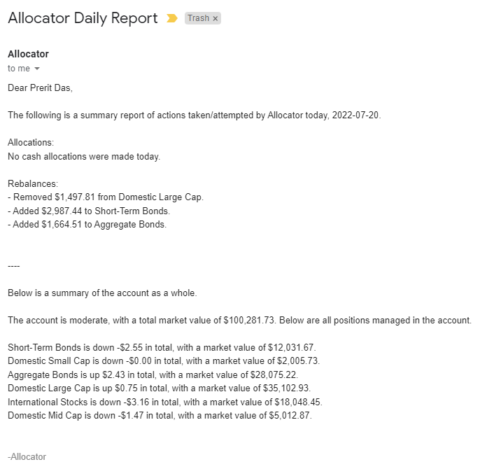

# Allocator

Allocator is a fully autonomous, dynamic portfolio manager. It both allocates free account cash to predetermine sectors _and_ reads accounts positions to determine if it should relatively re-balance any positions. This becomes necessary if certain sectors outperform other sectors, resulting in them occupying a larger than defined portion of the account. 

## Portfolios

Allocator's predefined portfolios are adapted from [Acorns](https://acorns.com) Invest's risk profiles. Those are true and tested portfolios, packaged into the local database [portfolios.json](portfolios.json). To select a portfolio, simply update the `portfolio_type` configuration element in [config.ini](config.ini). See steps to deployment in the [deployment](##deployment) section. The five supported portfolio types are below.

| Portfolio Type | Investment Composition |
| --- | --- |
| Conservative | Ultra short-term corporate and government bonds. |
| Moderately Conservative | Mostly short-term USD/aggregate bonds, with a small exposure in mid-cap and international stocks. |
| Moderate | Primarily domestic/international stocks, with a sizeable exposure to aggregate bonds. |
| Moderately Aggressive | Primarily large domestic stocks, with a sizeable exposure in internationals and domestic bonds. |
| Aggressive | Entirely domestic and international stocks. |

## Reports

Every day, after Allocator attempts to re-balance the portfolio and allocate free cash, it sends a report of all operations by email and text. A sample daily email report is below. It contains the following information.

- Cash allocations
- Rebalanced positions
  - Positions shaved
  - Positions bulked
  - Notice of unrecognized positions (more info below)
  - Notice of positions unallocated
- Account summary
  - Portfolio type (moderate, etc.)
  - Account market value (equity)
  - Each position (including untracked positions) with lifetime unrealized gains and total market value

A screenshot of a sample email report is below.

## Deployment

Only two files need to be modified for deployment: [keys (sample).py](_keys%20(sample).py) and [config.ini](config.ini). [keys (sample).py](_keys%20(sample).py) needs to be renamed to `_keys.py` in order to be recognized by Allocator. The following values need to be added or modified in each of the files.

### `_keys.py`

| Parameter | Type | Behavior | Source |
| --- | --- | --- | --- |
| `Alpaca.API_KEY` | string | Authenticates Alpaca API for trading | Portfolio Dashboard [Alpaca Markets](https://alpaca.markets) |
| `Alpaca.API_SECRET` | string | Authenticates Alpaca API for trading | Portfolio Dashboard [Alpaca Markets](https://alpaca.markets) |
| `Alpaca.BASE_URL` | string | Defines the Alpaca API's endpoint | Portfolio Dashboard [Alpaca Markets](https://alpaca.markets)
| --- | --- | --- | --- |
| `Nexmo.api_key` | string | Authenticates Nexmo for sending text messages | [Nexmo Dashboard](https://dashboard.nexmo.com) |
| `Nexmo.api_secret` | string | Authenticates Nexmo for sending text messages | [Nexmo Dashboard](https://dashboard.nexmo.com) |
| `Nexmo.sender` | string | Specifies which registered Nexmo number to originate text alerts | [Nexmo Dashboard](https://dashboard.nexmo.com)
| --- | --- | --- | --- |
| `Gmail.smtp_host` | string | Necessary for authenticating Gmail to send emails | Default is `'smtp.gmail.com'`. More information [here](https://support.google.com/mail/answer/7126229?hl=en#zippy=%2Cstep-check-that-imap-is-turned-on%2Cstep-change-smtp-other-settings-in-your-email-client). |
| `Gmail.smtp_port` | integer | Necessary for authenticating Gmail to send emails | Default is `465`. More information [here](https://support.google.com/mail/answer/7126229?hl=en#zippy=%2Cstep-check-that-imap-is-turned-on%2Cstep-change-smtp-other-settings-in-your-email-client). |
| `Gmail.email_address` | string | The Gmail _sender's_ address. | The account used to login to Gmail, as the sender. Can be your own email, if you want your reports to come from yourself. |
| `Gmail.password` | string | An _app password_. Gmail has revoked support for 'less-secure apps' so you must enable 2FA and generate an 'app password' instead. | [Google Account Settings](https://myaccount.google.com) |
| --- | --- | --- | --- |
| `User.name` | string | Your name, for daily reports. | Hopefully you remember your name. |
| `User.phone_number` | string | Target phone number for error alerts and daily reports. | Must be in the format `'14258193018'` for U.S. phone numbers. |
| `User.email_address` | string | Target email address for receiving daily reports. | Must be in the format `'youremail@gmail.com'`. |

### `config.ini`

| Parameter | Behavior | Default |
| --- | --- | --- |
| `rebalance_threshold` | The amount a position must vary from its true proportional value (according to portfolio allocation) in order for Allocator to re-balance it. | 0.01 |
| `portfolio_type` | User selected portfolio according to those specified in the [portfolios](##portfolios) section.