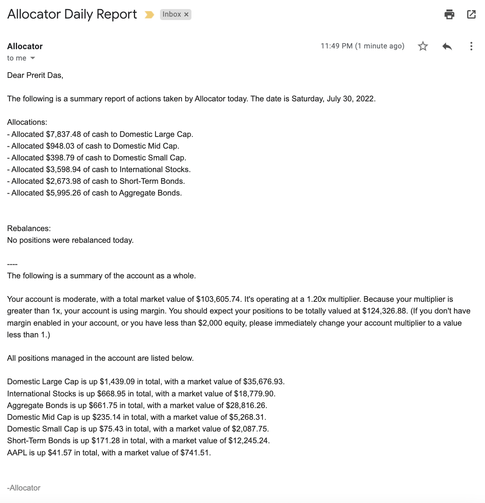

# Allocator

Allocator is a fully autonomous, dynamic portfolio manager. It both allocates free account cash to predetermine sectors _and_ reads accounts positions to determine if it should relatively re-balance any positions. This becomes necessary if certain sectors outperform other sectors, resulting in them occupying a larger than defined portion of the account. 

## Portfolios

Allocator's predefined portfolios are adapted from [Acorns](https://acorns.com) Invest's risk profiles. Those are true and tested portfolios, packaged into the local database [portfolios.json](portfolios.json). To select a portfolio, simply update the `portfolio_type` configuration element in [config.ini](config.ini). See steps to deployment in the [deployment](##deployment) section. The five supported portfolio types are below.

| Portfolio Type | Investment Composition |
| --- | --- |
| Conservative | Ultra short-term corporate and government bonds. |
| Moderately Conservative | Mostly short-term USD/aggregate bonds, with a small exposure in mid-cap and international stocks. |
| Moderate | Primarily domestic/international stocks, with a sizeable exposure to aggregate bonds. |
| Moderately Aggressive | Primarily large domestic stocks, with a sizeable exposure in internationals and domestic bonds. |
| Aggressive | Entirely domestic and international stocks. |

### Account Multiplier

If you want Allocator to make use of available margin in your account, increase the `portfolio_multiplier` in your [config.ini](config%20(sample).ini). The maximum multiplier is 2. You _must_ have margin enabled (with a positive margin buying power) to use this feature; Allocator will warn you at deployment if you don't.

By setting your account multiplier to a value less than 1, you can choose to manage only a fraction of your account, leaving the remaining balance as free cash. When you transfer funds to your account, Allocator will only invest what it can while leaving enough free cash in accordance with your multiplier. 

## Reports

Every day, after Allocator attempts to re-balance the portfolio and allocate free cash, it sends a report of all operations by email and text. A sample daily email report is below. It contains the following information.

(You can choose to not receive daily reports by text by setting `text_reports = false` in the `config.ini`. You will always receive reports by email, however.)

- Cash allocations
- Rebalanced positions
  - Positions shaved
  - Positions bulked
  - Notice of unrecognized positions (more info below)
  - Notice of positions unallocated
- Account summary
  - Portfolio type (moderate, etc.)
  - Account market value (equity)
  - Each position (including untracked positions) with lifetime unrealized gains and total market value

A screenshot of a sample email report is below.

## Deployment

Only two files need to be modified for deployment: [keys.ini](keys%20(sample).ini) and [config.ini](config%20(sample).ini). The following values need to be added or modified in each of the files.

1. (Optional but recommended) Use a hosted Linux server for guaranteed uptime, a strong internet connection, and fast data processing.
2. Clone this repository with the command `git clone https://github.com/preritdas/allocator.git`. 
3. Navigate into the repository folder with `cd allocator`. 
4. Create a template keys.ini file using the provided script: `sh configurate.sh`. 
5. Use an editor to fill out all the fields in `keys.ini`. Either Vim, Nano, or a desktop editor if available.
6. Use an editor to modify any values in `config.ini`, including your portfolio style.
7. Set up dependencies.
   1. Ensure you have Python 3.10.5 (Any version of Python 3.10 should work).
   2. Ensure you have pip and venv. If you don't, install pip by executing [get-pip.py](https://bootstrap.pypa.io/get-pip.py). Install venv by running `sudo apt-get install python3.10-venv -y`.
   3. Create a virtual environment for Allocator with `python3.10 -m venv venv`, replacing "python3.10" with the correct alias for your Python 3.10 installation.
   4. Activate the environment with `venv/bin/activate` (on Linux/Mac), or with `venv/Scripts/activate` if using Windows.
   5. Install all dependencies with `pip install -r requirements.txt` (in the environment, the `python` and `pip` aliases are correctly linked).
   6. Clear the screen with `clear`, then run Allocator with `python main.py`. 

If you want your script to run forever in the background, as is Allocator's design, use `tmux`. 

1. Create a new tmux session with `tmux new -s allocator`. 
2. Follow the deployment steps above.
3. Exit the session with `:detach`. 

Below is an example of an entirely shell-based deployment _and_ redeployment (re-cloning to update the source code while maintaining key and config files).

A couple notes about the recording:
- It's not necessary to manually remove __pycache__, readme-content, etc. Re-cloning and moving the files as I did afterwards will override these with updated source code. It's a good idea to remove and rebuild venv however, because dependencies may have changed.
- I tried re-cloning the repository into the root directory, which caused an error because the folder from the original clone existed. The solution, as shown afterwards, is to clone into the current "allocator" folder, then move all contents from the nested "allocator" to the current directory with `mv allocator/* .`. 
 

### keys.ini

| Parameter | Type | Behavior | Source |
| --- | --- | --- | --- |
| `Alpaca.API_KEY` | string | Authenticates Alpaca API for trading | Portfolio Dashboard [Alpaca Markets](https://alpaca.markets) |
| `Alpaca.API_SECRET` | string | Authenticates Alpaca API for trading | Portfolio Dashboard [Alpaca Markets](https://alpaca.markets) |
| `Alpaca.BASE_URL` | string | Defines the Alpaca API's endpoint | Portfolio Dashboard [Alpaca Markets](https://alpaca.markets)
| --- | --- | --- | --- |
| `Nexmo.api_key` | string | Authenticates Nexmo for sending text messages | [Nexmo Dashboard](https://dashboard.nexmo.com) |
| `Nexmo.api_secret` | string | Authenticates Nexmo for sending text messages | [Nexmo Dashboard](https://dashboard.nexmo.com) |
| `Nexmo.sender` | string | Specifies which registered Nexmo number to originate text alerts | [Nexmo Dashboard](https://dashboard.nexmo.com)
| --- | --- | --- | --- |
| `Gmail.smtp_host` | string | Necessary for authenticating Gmail to send emails | Default is `'smtp.gmail.com'`. More information [here](https://support.google.com/mail/answer/7126229?hl=en#zippy=%2Cstep-check-that-imap-is-turned-on%2Cstep-change-smtp-other-settings-in-your-email-client). |
| `Gmail.smtp_port` | integer | Necessary for authenticating Gmail to send emails | Default is `465`. More information [here](https://support.google.com/mail/answer/7126229?hl=en#zippy=%2Cstep-check-that-imap-is-turned-on%2Cstep-change-smtp-other-settings-in-your-email-client). |
| `Gmail.email_address` | string | The Gmail _sender's_ address. | The account used to login to Gmail, as the sender. Can be your own email, if you want your reports to come from yourself. |
| `Gmail.password` | string | An _app password_. Gmail has revoked support for 'less-secure apps' so you must enable 2FA and generate an 'app password' instead. | [Google Account Settings](https://myaccount.google.com) |
| --- | --- | --- | --- |
| `User.name` | string | Your name, for daily reports. | Hopefully you remember your name. |
| `User.phone_number` | string | Target phone number for error alerts and daily reports. | Must be in the format `'14258193018'` for U.S. phone numbers. |
| `User.email_address` | string | Target email address for receiving daily reports. | Must be in the format `'youremail@gmail.com'`. |

### config.ini

| Parameter | Behavior | Default |
| --- | --- | --- |
| `rebalance_threshold` | The amount a position must vary from its true proportional value (according to portfolio allocation) in order for Allocator to re-balance it. | 0.01 |
| `portfolio_type` | User selected portfolio according to those specified in the [portfolios](##portfolios) section. | moderate |
| `account_multiplier` | Maintain a portfolio size less or greater (if margin enabled) than your cash balance. | 1 |
| `text_reports` | Choose whether to receive daily reports by text as well as by email. | false |
| `additional_recipients` | Specify a list of emails to which you'd like your reports sent, Do so in the format `additional_recipients = email@gmail.com, email2@me.com` etc. with a comma and space between each email. | '' (empty) |
